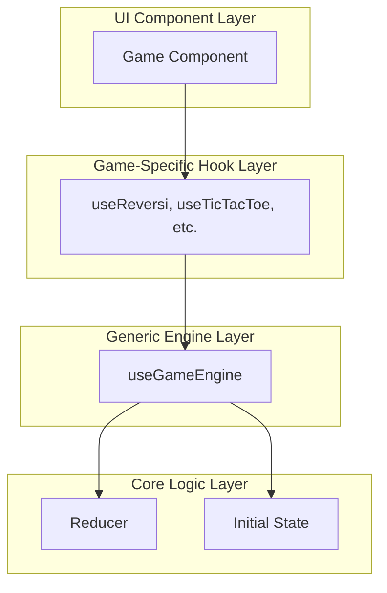

# 設計書 - 汎用ゲームエンジン

## 概要

本設計書では、全ゲーム共通の状態管理を「初期状態 + アクション列の合成」で統一するシステムを定義する。これはReduxライクな設計思想を採用し、状態の予測可能性と再現性を向上させることを目的とする。

-   **Phase 1**: 状態管理の基盤となるエンジンを構築する。（完了）
-   **Phase 2**: Phase 1の基盤上に、タイムトラベル機能と状態再現機能を追加する。（今回計画）

---

## Phase 1: 状態合成基盤の設計（完了）

### 1. 設計原則

1.  **純粋性**: 全ての状態遷移は純粋関数として表現
2.  **合成性**: 状態 = reduce(actions, initialState) の数式で表現
3.  **汎用性**: ゲーム固有のロジックに依存しない共通エンジン
4.  **互換性**: 既存システムとの段階的統合

### 2. アーキテクチャ

#### 全体構成


#### データフロー
`Initial State + [Action1, Action2, ...]` を `reducer` で畳み込むことで `Current State` を導出する。

### 3. コンポーネント設計

汎用的な状態管理エンジンの核となる`useGameEngine`フックを実装。ゲーム固有の`reducer`と`initialState`を注入することで、様々なゲームに対応する。

---

## Phase 2: タイムトラベル機能の拡張設計

### 4. `useGameEngine`の機能拡張

Phase 1で構築した`useGameEngine`フックに、履歴を操作するための機能を追加する。

#### 4.1. 拡張後のインターフェース
`useGameEngine`が返すオブジェクトの最終的なインターフェース。

```typescript
interface GameEngine<TState, TAction> {
  // --- 基本状態 ---
  gameState: TState;

  // --- アクション発行 ---
  dispatch: (action: TAction) => void;
  reset: () => void;
  reconstruct: (actions: TAction[]) => void;

  // --- タイムトラベル機能 ---
  undo: () => void;
  redo: () => void;
  goToIndex: (index: number) => void;
  
  // --- 読み取り専用のデバッグ/UI情報 ---
  readonly actions: readonly TAction[];
  readonly currentIndex: number;
  readonly canUndo: boolean;
  readonly canRedo: boolean;
  readonly initialState: TState;
  readonly reducer: (state: TState, action: TAction) => TState;
}
```

#### 4.2. 実装方針

`useState`を用いて、アクション履歴を保持する`actions`と、履歴上の現在位置を示す`currentIndex`の2つを管理する。

```typescript
function useGameEngine<TState, TAction>(
  reducer: (state: TState, action: TAction) => TState,
  initialState: TState
): GameEngine<TState, TAction> {
  
  const [actions, setActions] = useState<TAction[]>([]);
  const [currentIndex, setCurrentIndex] = useState(0);

  // gameStateは、currentIndexまでのアクション列を畳み込んで計算する
  const gameState = useMemo(() => {
    return actions.slice(0, currentIndex).reduce(reducer, initialState);
  }, [actions, currentIndex, reducer, initialState]);

  // アクション発行時、履歴の途中であれば、それ以降の履歴を破棄して新しい分岐を作成
  const dispatch = useCallback((action: TAction) => {
    const newActions = [...actions.slice(0, currentIndex), action];
    setActions(newActions);
    setCurrentIndex(newActions.length);
  }, [actions, currentIndex]);

  const reset = useCallback(() => {
    setActions([]);
    setCurrentIndex(0);
  }, []);

  const reconstruct = useCallback((newActions: TAction[]) => {
    setActions(newActions);
    setCurrentIndex(newActions.length);
  }, []);

  const undo = useCallback(() => {
    setCurrentIndex(i => Math.max(0, i - 1));
  }, []);

  const redo = useCallback(() => {
    setCurrentIndex(i => Math.min(actions.length, i + 1));
  }, [actions.length]);

  const goToIndex = useCallback((index: number) => {
    setCurrentIndex(Math.max(0, Math.min(actions.length, index)));
  }, [actions.length]);

  const canUndo = currentIndex > 0;
  const canRedo = currentIndex < actions.length;

  return {
    gameState,
    dispatch,
    reset,
    reconstruct,
    undo,
    redo,
    goToIndex,
    actions,
    currentIndex,
    canUndo,
    canRedo,
    initialState,
    reducer,
  };
}
```

### 5. テスト戦略の拡張

#### 5.1. `useGameEngine`のタイムトラベル機能テスト
-   `undo`を呼び出すと`currentIndex`がデクリメントされること。
-   `redo`を呼び出すと`currentIndex`がインクリメントされること。
-   `canUndo`/`canRedo`フラグが`currentIndex`に応じて正しく変化すること。
-   履歴の途中で`dispatch`すると、古い履歴が正しく破棄され、新しいアクションが追加されること。
-   `reconstruct`でアクション列が正しく設定されること。

#### 5.2. `useReversi`のリファクタリング後テスト
-   `useReversi`フックが、拡張された`useGameEngine`の`undo`/`redo`機能を正しくラップし、UIに提供できることを確認する。
-   既存の`useReversi`のテストケースが、リファクタリング後もすべてパスすることを確認する（回帰テスト）。

### 6. デバッグ機能の活用構想

拡張された`useGameEngine`の`actions`と`currentIndex`プロパティを利用し、汎用的な`GameDebugger`コンポーネントを構築する。

```typescript
// GameDebuggerでの活用イメージ
function GameDebugger<TState, TAction>({
  engine
}: {
  engine: GameEngine<TState, TAction>
}) {
  const { actions, currentIndex, goToIndex, canUndo, canRedo } = engine;

  // actions配列をリスト表示し、currentIndexの項目をハイライトする
  // 各項目をクリックするとgoToIndexが呼ばれる
  // canUndo/canRedoフラグに応じてUndo/Redoボタンを有効/無効化する

  return (
    <div>
      <h3>アクション履歴 ({currentIndex} / {actions.length})</h3>
      {/* ... 履歴リストのレンダリング ... */}
      <button onClick={engine.undo} disabled={!canUndo}>一手戻る</button>
      <button onClick={engine.redo} disabled={!canRedo}>一手進む</button>
    </div>
  );
}
```
これにより、どのゲームでも共通のタイムトラベルUIを提供できるようになり、デバッグ効率が大幅に向上する。