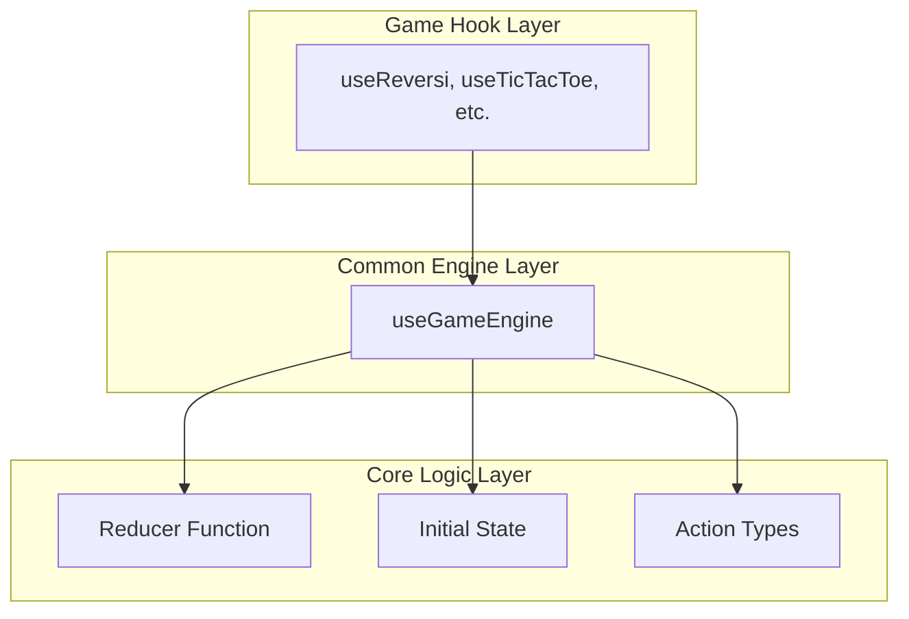

# 設計書 - ゲーム状態管理の合成化（Phase 1）

## 概要

本設計書では、全ゲーム共通の状態管理を「初期状態 + アクション列の合成」で統一するシステムを定義する。これはReduxライクな設計思想を採用し、状態の予測可能性と再現性を向上させる。

### 設計原則

1. **純粋性**: 全ての状態遷移は純粋関数として表現
2. **合成性**: 状態 = reduce(actions, initialState) の数式で表現
3. **汎用性**: ゲーム固有のロジックに依存しない共通エンジン
4. **互換性**: 既存システムとの段階的統合

## アーキテクチャ

### 全体構成



### データフロー

```
Initial State + [Action1, Action2, Action3, ...] 
    ↓ reduce
Current State
```

## コンポーネント設計

### 1. useGameEngine フック

汎用的な状態管理エンジンの核となるフック。

```typescript
interface GameEngine<TState, TAction> {
  // 現在の状態（計算結果）
  gameState: TState;
  
  // アクション実行
  dispatch: (action: TAction) => void;
  
  // リセット
  reset: () => void;
  
  // 本質的な情報の読み取り専用アクセス
  readonly actions: readonly TAction[];
  readonly initialState: TState;
  readonly reducer: (state: TState, action: TAction) => TState;
}

function useGameEngine<TState, TAction>(
  reducer: (state: TState, action: TAction) => TState,
  initialState: TState
): GameEngine<TState, TAction>
```

#### 実装方針

```typescript
function useGameEngine<TState, TAction>(
  reducer: (state: TState, action: TAction) => TState,
  initialState: TState
): GameEngine<TState, TAction> {
  
  const [actions, setActions] = useState<TAction[]>([]);
  
  // 状態の動的計算
  const gameState = useMemo(() => {
    return actions.reduce(reducer, initialState);
  }, [actions, reducer, initialState]);
  
  const dispatch = useCallback((action: TAction) => {
    setActions(prev => [...prev, action]);
  }, []);
  
  const reset = useCallback(() => {
    setActions([]);
  }, []);
  
  return {
    gameState,
    dispatch,
    reset,
    actions,
    initialState,
    reducer
  };
}
```

### 2. ゲーム固有フックの変更

既存のゲームフックを useGameEngine を使用する形に変更。

#### リバーシの例

```typescript
// Before: 複雑な状態管理
function useReversi(): ReversiController {
  const [gameHistory, setGameHistory] = useState<ReversiGameState[]>([...]);
  const [currentHistoryIndex, setCurrentHistoryIndex] = useState(0);
  // ... 複雑な履歴管理ロジック
}

// After: useGameEngine を使用
function useReversi(): ReversiController {
  const {
    gameState,
    dispatch,
    reset,
    actions
  } = useGameEngine(reversiReducer, createInitialReversiState());
  
  const makeMove = useCallback((row: number, col: number) => {
    dispatch({ type: 'MAKE_MOVE', row, col });
  }, [dispatch]);
  
  const resetGame = useCallback(() => {
    reset();
  }, [reset]);
  
  return {
    gameState,
    makeMove,
    resetGame,
    // 既存のインターフェースを維持
    getDisplayStatus: () => getDisplayStatus(gameState),
    // ...
  };
}
```

### 3. Reducer の実装

既存の core.ts ロジックを reducer 形式に変換。

```typescript
// リバーシの例
type ReversiAction =
  | { type: 'MAKE_MOVE'; row: number; col: number }
  | { type: 'RESET_GAME' };

function reversiReducer(
  state: ReversiGameState,
  action: ReversiAction
): ReversiGameState {
  switch (action.type) {
    case 'MAKE_MOVE':
      // 既存の handleCellClick ロジックを使用
      const newState = handleCellClick(state, action.row, action.col);
      return newState || state; // 無効な手の場合は状態を変更しない
      
    case 'RESET_GAME':
      return createInitialState();
      
    default:
      return state;
  }
}
```

## 移行戦略

### Phase 1 の実装順序

1. **useGameEngine の実装**: 汎用エンジンの作成とテスト
2. **TicTacToe の移行**: 最もシンプルなゲームでの検証
3. **リバーシの移行**: 既存の複雑な履歴機能を置き換え
4. **他ゲームの移行**: 段階的な展開

### 既存システムとの共存

```typescript
// 移行期間中の互換性レイヤー
function useLegacyCompatibility<TState, TAction>(
  gameEngine: GameEngine<TState, TAction>
): LegacyController {
  
  // 既存インターフェースを新しいエンジンにマッピング
  return {
    gameState: gameEngine.gameState,
    resetGame: gameEngine.reset,
    // dispatch は内部で適切なアクションに変換
    // ...
  };
}
```

## テスト戦略

### 1. Reducer のテスト

```typescript
describe('reversiReducer', () => {
  it('should handle MAKE_MOVE action', () => {
    const initialState = createInitialState();
    const action = { type: 'MAKE_MOVE', row: 2, col: 3 };
    
    const newState = reversiReducer(initialState, action);
    
    expect(newState.board[2][3]).toBe('BLACK');
    expect(newState.currentPlayer).toBe('WHITE');
  });
  
  it('should be pure function', () => {
    const state = createInitialState();
    const action = { type: 'MAKE_MOVE', row: 2, col: 3 };
    
    const result1 = reversiReducer(state, action);
    const result2 = reversiReducer(state, action);
    
    expect(result1).toEqual(result2);
    expect(state).toEqual(createInitialState()); // 元の状態は変更されない
  });
});
```

### 2. useGameEngine のテスト

```typescript
describe('useGameEngine', () => {
  it('should compute state from actions', () => {
    const { result } = renderHook(() => 
      useGameEngine(mockReducer, mockInitialState)
    );
    
    act(() => {
      result.current.dispatch({ type: 'TEST_ACTION' });
    });
    
    expect(result.current.gameState).toEqual(
      mockReducer(mockInitialState, { type: 'TEST_ACTION' })
    );
  });
  
  it('should reset to initial state', () => {
    const { result } = renderHook(() => 
      useGameEngine(mockReducer, mockInitialState)
    );
    
    // アクション実行
    act(() => {
      result.current.dispatch({ type: 'TEST_ACTION' });
    });
    
    // リセット
    act(() => {
      result.current.reset();
    });
    
    expect(result.current.gameState).toEqual(mockInitialState);
    expect(result.current.actions).toEqual([]);
  });
});
```

### 3. 統合テスト

```typescript
describe('useReversi with useGameEngine', () => {
  it('should maintain same behavior as before', () => {
    const { result } = renderHook(() => useReversi());
    
    // 既存のテストケースがそのまま通ることを確認
    act(() => {
      result.current.makeMove(2, 3);
    });
    
    expect(result.current.gameState.board[2][3]).toBe('BLACK');
  });
});
```

## パフォーマンス考慮事項

### メモ化の活用

```typescript
function useGameEngine<TState, TAction>(
  reducer: (state: TState, action: TAction) => TState,
  initialState: TState
): GameEngine<TState, TAction> {
  
  // reducer と initialState の変更を検知
  const memoizedReducer = useCallback(reducer, []);
  const memoizedInitialState = useMemo(() => initialState, []);
  
  // 状態計算のメモ化
  const gameState = useMemo(() => {
    return actions.reduce(memoizedReducer, memoizedInitialState);
  }, [actions, memoizedReducer, memoizedInitialState]);
  
  return { gameState, /* ... */ };
}
```

### 大量アクションへの対応

Phase 1 では基本実装に集中し、パフォーマンス最適化は後続フェーズで対応する。

## デバッグ・テスト支援の設計

GameEngineの本質的な機能（`actions`, `initialState`, `reducer`の読み取り専用アクセス）を活用して、別レイヤーでデバッグ機能を実現する。

### 1. デバッグユーティリティ関数

```typescript
// src/core/debug/gameEngineDebugUtils.ts
export class GameEngineDebugUtils<TState, TAction> {
  constructor(
    private engine: GameEngine<TState, TAction>
  ) {}
  
  // 任意のアクション列から状態を計算
  computeStateFromActions(actions: TAction[]): TState {
    return actions.reduce(this.engine.reducer, this.engine.initialState);
  }
  
  // 特定のインデックスまでの状態を計算
  computeStateAtIndex(index: number): TState {
    const slicedActions = this.engine.actions.slice(0, index);
    return this.computeStateFromActions(slicedActions);
  }
  
  // アクション列の妥当性検証
  validateActionSequence(actions: TAction[]): {
    isValid: boolean;
    errorIndex?: number;
    error?: string;
  } {
    try {
      let state = this.engine.initialState;
      for (let i = 0; i < actions.length; i++) {
        const newState = this.engine.reducer(state, actions[i]);
        if (newState === state) {
          // 状態が変化しない = 無効なアクション
          return {
            isValid: false,
            errorIndex: i,
            error: `Invalid action at index ${i}: ${JSON.stringify(actions[i])}`
          };
        }
        state = newState;
      }
      return { isValid: true };
    } catch (error) {
      return {
        isValid: false,
        error: error instanceof Error ? error.message : 'Unknown error'
      };
    }
  }
  
  // 状態の差分を分析
  analyzeStateDiff(beforeActions: TAction[], afterActions: TAction[]): {
    beforeState: TState;
    afterState: TState;
    actionDiff: TAction[];
  } {
    return {
      beforeState: this.computeStateFromActions(beforeActions),
      afterState: this.computeStateFromActions(afterActions),
      actionDiff: afterActions.slice(beforeActions.length)
    };
  }
}
```

### 2. テストでの活用

```typescript
// テストでの使用例
describe('Game Logic Test', () => {
  it('should handle complex game sequence', () => {
    const { result } = renderHook(() => 
      useGameEngine(reversiReducer, initialState)
    );
    
    const debugUtils = new GameEngineDebugUtils(result.current);
    
    // 特定のアクション列をテスト
    const testActions = [
      { type: 'MAKE_MOVE', row: 2, col: 3 },
      { type: 'MAKE_MOVE', row: 2, col: 2 },
      { type: 'MAKE_MOVE', row: 2, col: 4 }
    ];
    
    // アクション列の妥当性を事前検証
    const validation = debugUtils.validateActionSequence(testActions);
    expect(validation.isValid).toBe(true);
    
    // 実際にアクションを実行
    testActions.forEach(action => {
      act(() => {
        result.current.dispatch(action);
      });
    });
    
    // 結果を検証
    expect(result.current.gameState.currentPlayer).toBe('WHITE');
    
    // 途中の状態も検証可能
    const stateAfterTwoMoves = debugUtils.computeStateAtIndex(2);
    expect(stateAfterTwoMoves.scores.BLACK).toBe(4);
  });
  
  it('should detect invalid action sequences', () => {
    const { result } = renderHook(() => 
      useGameEngine(reversiReducer, initialState)
    );
    
    const debugUtils = new GameEngineDebugUtils(result.current);
    
    // 無効なアクション列
    const invalidActions = [
      { type: 'MAKE_MOVE', row: 0, col: 0 }, // 無効な手
    ];
    
    const validation = debugUtils.validateActionSequence(invalidActions);
    expect(validation.isValid).toBe(false);
    expect(validation.errorIndex).toBe(0);
    expect(validation.error).toContain('Invalid action');
  });
});
```

### 3. GameDebugger での活用

```typescript
// GameDebugger での使用例
function GameDebugger<TState, TAction>({ 
  gameEngine 
}: { 
  gameEngine: GameEngine<TState, TAction> 
}) {
  const debugUtils = useMemo(() => 
    new GameEngineDebugUtils(gameEngine), [gameEngine]
  );
  
  const [selectedIndex, setSelectedIndex] = useState(gameEngine.actions.length);
  
  const currentDisplayState = useMemo(() => {
    return debugUtils.computeStateAtIndex(selectedIndex);
  }, [debugUtils, selectedIndex]);
  
  return (
    <div>
      <h3>アクション履歴 ({gameEngine.actions.length}件)</h3>
      
      <div>
        <input
          type="range"
          min={0}
          max={gameEngine.actions.length}
          value={selectedIndex}
          onChange={(e) => setSelectedIndex(Number(e.target.value))}
        />
        <span>ステップ: {selectedIndex} / {gameEngine.actions.length}</span>
      </div>
      
      {gameEngine.actions.map((action, index) => (
        <div 
          key={index} 
          onClick={() => setSelectedIndex(index + 1)}
          style={{
            backgroundColor: index < selectedIndex ? '#4CAF50' : '#666',
            cursor: 'pointer',
            padding: '4px',
            margin: '2px'
          }}
        >
          {index + 1}: {JSON.stringify(action)}
        </div>
      ))}
      
      <div>
        <h4>ステップ {selectedIndex} の状態</h4>
        <pre>{JSON.stringify(currentDisplayState, null, 2)}</pre>
      </div>
      
      <div>
        <h4>アクション列の妥当性</h4>
        {(() => {
          const validation = debugUtils.validateActionSequence(gameEngine.actions);
          return validation.isValid ? (
            <span style={{ color: 'green' }}>✓ 有効</span>
          ) : (
            <span style={{ color: 'red' }}>✗ エラー: {validation.error}</span>
          );
        })()}
      </div>
    </div>
  );
}
```

## 期待される効果

### 1. 状態管理の改善
- **予測可能性**: 同じアクション列は常に同じ結果
- **再現性**: 任意の状態を確実に再現可能
- **純粋性**: 副作用のない状態遷移

### 2. テスト容易性の向上
- **Reducer テスト**: 純粋関数として独立テスト
- **アクション列テスト**: 複雑なシナリオの組み合わせテスト
- **妥当性検証**: 無効なアクション列の自動検出
- **状態差分分析**: 変更前後の状態比較

### 3. デバッグ支援の強化
- **タイムトラベルデバッグ**: 任意の時点の状態を確認
- **アクション履歴の可視化**: 操作の流れを追跡
- **エラー原因の特定**: 無効なアクションの位置を特定
- **状態遷移の検証**: 期待通りの状態変化かを確認

### 4. AI テスト支援への貢献
- **詳細なエラー情報**: どのアクションで何が起きたかを明確化
- **状態の完全な可視性**: 内部状態の全てを確認可能
- **再現可能なテストケース**: 失敗したケースを確実に再現
- **段階的デバッグ**: ステップバイステップでの問題特定

### 5. 将来の拡張性
- **Phase 2 基盤**: 任意盤面再現の土台
- **Phase 3 基盤**: ユーザー履歴遷移の土台
- **新機能追加**: デバッグユーティリティの拡張が容易

この Phase 1 の完成により、開発者とAIの両方が、ゲームの状態遷移を詳細に理解・検証でき、テストNG の原因特定が大幅に効率化される。