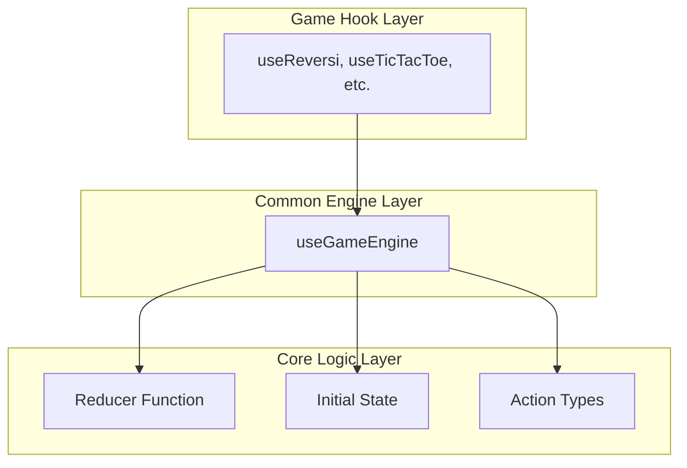

# 設計書 - ゲーム状態管理の合成化（Phase 1）

## 概要

本設計書では、全ゲーム共通の状態管理を「初期状態 + アクション列の合成」で統一するシステムを定義する。これはReduxライクな設計思想を採用し、状態の予測可能性と再現性を向上させる。

### 設計原則

1. **純粋性**: 全ての状態遷移は純粋関数として表現
2. **合成性**: 状態 = reduce(actions, initialState) の数式で表現
3. **汎用性**: ゲーム固有のロジックに依存しない共通エンジン
4. **互換性**: 既存システムとの段階的統合

## アーキテクチャ

### 全体構成



### データフロー

```
Initial State + [Action1, Action2, Action3, ...] 
    ↓ reduce
Current State
```

## コンポーネント設計

### 1. useGameEngine フック

汎用的な状態管理エンジンの核となるフック。

```typescript
interface GameEngine<TState, TAction> {
  // 現在の状態（計算結果）
  gameState: TState;
  
  // アクション実行
  dispatch: (action: TAction) => void;
  
  // リセット
  reset: () => void;
  
  // デバッグ・テスト用の状態監視・操作
  actions: readonly TAction[];
  initialState: TState;
  
  // デバッグ用: 任意のアクション列から状態を計算
  computeStateFromActions: (actions: TAction[]) => TState;
  
  // デバッグ用: アクション列を直接設定
  setActions: (actions: TAction[]) => void;
  
  // デバッグ用: 特定のインデックスまでのアクションで状態を計算
  computeStateAtIndex: (index: number) => TState;
}

function useGameEngine<TState, TAction>(
  reducer: (state: TState, action: TAction) => TState,
  initialState: TState
): GameEngine<TState, TAction>
```

#### 実装方針

```typescript
function useGameEngine<TState, TAction>(
  reducer: (state: TState, action: TAction) => TState,
  initialState: TState
): GameEngine<TState, TAction> {
  
  const [actions, setActionsState] = useState<TAction[]>([]);
  
  // 状態の動的計算
  const gameState = useMemo(() => {
    return actions.reduce(reducer, initialState);
  }, [actions, reducer, initialState]);
  
  const dispatch = useCallback((action: TAction) => {
    setActionsState(prev => [...prev, action]);
  }, []);
  
  const reset = useCallback(() => {
    setActionsState([]);
  }, []);
  
  // デバッグ用: 任意のアクション列から状態を計算
  const computeStateFromActions = useCallback((actionList: TAction[]) => {
    return actionList.reduce(reducer, initialState);
  }, [reducer, initialState]);
  
  // デバッグ用: アクション列を直接設定
  const setActions = useCallback((newActions: TAction[]) => {
    setActionsState(newActions);
  }, []);
  
  // デバッグ用: 特定のインデックスまでの状態を計算
  const computeStateAtIndex = useCallback((index: number) => {
    const slicedActions = actions.slice(0, index);
    return slicedActions.reduce(reducer, initialState);
  }, [actions, reducer, initialState]);
  
  return {
    gameState,
    dispatch,
    reset,
    actions,
    initialState,
    computeStateFromActions,
    setActions,
    computeStateAtIndex
  };
}
```

### 2. ゲーム固有フックの変更

既存のゲームフックを useGameEngine を使用する形に変更。

#### リバーシの例

```typescript
// Before: 複雑な状態管理
function useReversi(): ReversiController {
  const [gameHistory, setGameHistory] = useState<ReversiGameState[]>([...]);
  const [currentHistoryIndex, setCurrentHistoryIndex] = useState(0);
  // ... 複雑な履歴管理ロジック
}

// After: useGameEngine を使用
function useReversi(): ReversiController {
  const {
    gameState,
    dispatch,
    reset,
    actions
  } = useGameEngine(reversiReducer, createInitialReversiState());
  
  const makeMove = useCallback((row: number, col: number) => {
    dispatch({ type: 'MAKE_MOVE', row, col });
  }, [dispatch]);
  
  const resetGame = useCallback(() => {
    reset();
  }, [reset]);
  
  return {
    gameState,
    makeMove,
    resetGame,
    // 既存のインターフェースを維持
    getDisplayStatus: () => getDisplayStatus(gameState),
    // ...
  };
}
```

### 3. Reducer の実装

既存の core.ts ロジックを reducer 形式に変換。

```typescript
// リバーシの例
type ReversiAction =
  | { type: 'MAKE_MOVE'; row: number; col: number }
  | { type: 'RESET_GAME' };

function reversiReducer(
  state: ReversiGameState,
  action: ReversiAction
): ReversiGameState {
  switch (action.type) {
    case 'MAKE_MOVE':
      // 既存の handleCellClick ロジックを使用
      const newState = handleCellClick(state, action.row, action.col);
      return newState || state; // 無効な手の場合は状態を変更しない
      
    case 'RESET_GAME':
      return createInitialState();
      
    default:
      return state;
  }
}
```

## 移行戦略

### Phase 1 の実装順序

1. **useGameEngine の実装**: 汎用エンジンの作成とテスト
2. **TicTacToe の移行**: 最もシンプルなゲームでの検証
3. **リバーシの移行**: 既存の複雑な履歴機能を置き換え
4. **他ゲームの移行**: 段階的な展開

### 既存システムとの共存

```typescript
// 移行期間中の互換性レイヤー
function useLegacyCompatibility<TState, TAction>(
  gameEngine: GameEngine<TState, TAction>
): LegacyController {
  
  // 既存インターフェースを新しいエンジンにマッピング
  return {
    gameState: gameEngine.gameState,
    resetGame: gameEngine.reset,
    // dispatch は内部で適切なアクションに変換
    // ...
  };
}
```

## テスト戦略

### 1. Reducer のテスト

```typescript
describe('reversiReducer', () => {
  it('should handle MAKE_MOVE action', () => {
    const initialState = createInitialState();
    const action = { type: 'MAKE_MOVE', row: 2, col: 3 };
    
    const newState = reversiReducer(initialState, action);
    
    expect(newState.board[2][3]).toBe('BLACK');
    expect(newState.currentPlayer).toBe('WHITE');
  });
  
  it('should be pure function', () => {
    const state = createInitialState();
    const action = { type: 'MAKE_MOVE', row: 2, col: 3 };
    
    const result1 = reversiReducer(state, action);
    const result2 = reversiReducer(state, action);
    
    expect(result1).toEqual(result2);
    expect(state).toEqual(createInitialState()); // 元の状態は変更されない
  });
});
```

### 2. useGameEngine のテスト

```typescript
describe('useGameEngine', () => {
  it('should compute state from actions', () => {
    const { result } = renderHook(() => 
      useGameEngine(mockReducer, mockInitialState)
    );
    
    act(() => {
      result.current.dispatch({ type: 'TEST_ACTION' });
    });
    
    expect(result.current.gameState).toEqual(
      mockReducer(mockInitialState, { type: 'TEST_ACTION' })
    );
  });
  
  it('should reset to initial state', () => {
    const { result } = renderHook(() => 
      useGameEngine(mockReducer, mockInitialState)
    );
    
    // アクション実行
    act(() => {
      result.current.dispatch({ type: 'TEST_ACTION' });
    });
    
    // リセット
    act(() => {
      result.current.reset();
    });
    
    expect(result.current.gameState).toEqual(mockInitialState);
    expect(result.current.actions).toEqual([]);
  });
});
```

### 3. 統合テスト

```typescript
describe('useReversi with useGameEngine', () => {
  it('should maintain same behavior as before', () => {
    const { result } = renderHook(() => useReversi());
    
    // 既存のテストケースがそのまま通ることを確認
    act(() => {
      result.current.makeMove(2, 3);
    });
    
    expect(result.current.gameState.board[2][3]).toBe('BLACK');
  });
});
```

## パフォーマンス考慮事項

### メモ化の活用

```typescript
function useGameEngine<TState, TAction>(
  reducer: (state: TState, action: TAction) => TState,
  initialState: TState
): GameEngine<TState, TAction> {
  
  // reducer と initialState の変更を検知
  const memoizedReducer = useCallback(reducer, []);
  const memoizedInitialState = useMemo(() => initialState, []);
  
  // 状態計算のメモ化
  const gameState = useMemo(() => {
    return actions.reduce(memoizedReducer, memoizedInitialState);
  }, [actions, memoizedReducer, memoizedInitialState]);
  
  return { gameState, /* ... */ };
}
```

### 大量アクションへの対応

Phase 1 では基本実装に集中し、パフォーマンス最適化は後続フェーズで対応する。

## デバッグ・テスト支援機能

Phase 1 でも以下のデバッグ・テスト機能が利用可能：

### 1. テストコードからの状態操作

```typescript
// テストでの使用例
describe('Game Logic Test', () => {
  it('should handle complex game sequence', () => {
    const { result } = renderHook(() => 
      useGameEngine(reversiReducer, initialState)
    );
    
    // 特定のアクション列をテスト
    const testActions = [
      { type: 'MAKE_MOVE', row: 2, col: 3 },
      { type: 'MAKE_MOVE', row: 2, col: 2 },
      { type: 'MAKE_MOVE', row: 2, col: 4 }
    ];
    
    // アクション列を直接設定
    act(() => {
      result.current.setActions(testActions);
    });
    
    // 結果を検証
    expect(result.current.gameState.currentPlayer).toBe('WHITE');
    
    // 途中の状態も検証可能
    const stateAfterTwoMoves = result.current.computeStateAtIndex(2);
    expect(stateAfterTwoMoves.scores.BLACK).toBe(4);
  });
});
```

### 2. GameDebugger での状態監視

```typescript
// GameDebugger での使用例
function GameDebugger() {
  const gameEngine = useGameEngineDebugInfo(); // グローバルに取得
  
  const handleReplayActions = () => {
    // アクション列を再実行
    gameEngine.setActions([...gameEngine.actions]);
  };
  
  const handleGoToStep = (index: number) => {
    // 特定のステップの状態を表示
    const stateAtStep = gameEngine.computeStateAtIndex(index);
    console.log('State at step', index, stateAtStep);
  };
  
  return (
    <div>
      <h3>アクション履歴</h3>
      {gameEngine.actions.map((action, index) => (
        <div key={index} onClick={() => handleGoToStep(index + 1)}>
          {index + 1}: {JSON.stringify(action)}
        </div>
      ))}
      
      <button onClick={handleReplayActions}>
        アクション再実行
      </button>
      
      <div>
        <h4>現在の状態</h4>
        <pre>{JSON.stringify(gameEngine.gameState, null, 2)}</pre>
      </div>
    </div>
  );
}
```

### 3. 開発者ツールでの直接操作

```typescript
// ブラウザのコンソールから直接操作可能
window.gameDebug = {
  // 現在のゲーム状態を取得
  getCurrentState: () => gameEngine.gameState,
  
  // アクション履歴を取得
  getActions: () => gameEngine.actions,
  
  // 特定の状態を再現
  replayToStep: (index: number) => {
    const actions = gameEngine.actions.slice(0, index);
    gameEngine.setActions(actions);
  },
  
  // カスタムアクション列をテスト
  testActionSequence: (actions: TAction[]) => {
    return gameEngine.computeStateFromActions(actions);
  }
};
```

## 期待される効果

1. **状態の予測可能性**: 同じアクション列は常に同じ結果
2. **テスト容易性**: reducer の純粋関数テスト + アクション列テスト
3. **デバッグ支援**: アクション列による状態再現・監視・操作
4. **タイムトラベルデバッグ**: 任意の時点の状態を確認・復元
5. **将来の拡張性**: Phase 2, 3 の基盤構築

この Phase 1 の完成により、開発者は任意のゲーム状態を簡単に再現・検証でき、後続の「任意盤面再現」「ユーザー履歴遷移」の実装も大幅に簡素化される。