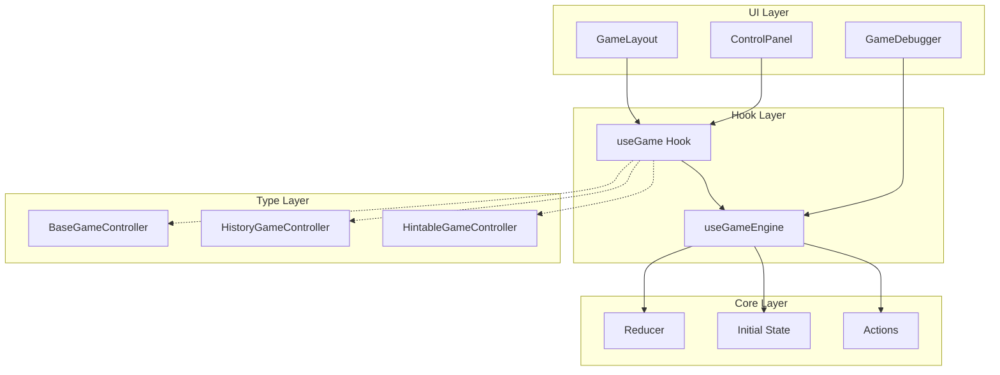

# 設計書 - ゲーム共通タイムトラベル機能

## 概要

本設計書では、要件定義書で定義された全ゲーム共通のタイムトラベル機能を実現するためのアーキテクチャと実装方針を定義する。

### 設計原則

1. **関心の分離**: タイムトラベル機能とゲーム固有ロジックを完全に分離
2. **選択的採用**: ゲームごとに必要な機能のみを選択的に実装可能
3. **型安全性**: TypeScriptの型システムを活用した堅牢な設計
4. **メモリ効率**: アクションベースの履歴管理による効率的なメモリ使用
5. **既存システム統合**: 現在のレスポンシブアーキテクチャとの自然な統合

## アーキテクチャ

### 全体構成



### レイヤー責務

#### UI Layer
- **GameLayout**: レスポンシブレイアウトの管理、コントローラーインターフェースに基づくUI表示
- **ControlPanel**: タイムトラベル操作UI（PC: サイドバー、モバイル: ボトムシート）
- **GameDebugger**: 開発時のアクション履歴とステート監視

#### Hook Layer
- **useGameEngine**: 汎用タイムトラベルエンジン（ゲーム非依存）
- **useGame Hook**: ゲーム固有フック（useReversi等）、useGameEngineをラップ

#### Core Layer
- **Reducer**: 純粋な状態遷移関数
- **Initial State**: ゲームの初期状態
- **Actions**: 状態変更を表現するアクション定義

#### Type Layer
- **インターフェース合成**: 機能の組み合わせを型レベルで表現

## コンポーネント設計

### 1. useGameEngine フック（階層化対応）

階層化されたアクション管理を提供する汎用タイムトラベルエンジン。

```typescript
interface DualHistoryGameEngine<TGameState, TFullState, TGameAction, TInternalAction> {
  // 現在の状態
  gameState: TGameState;
  fullState: TFullState;
  
  // アクション実行
  dispatchGameAction: (action: TGameAction) => void;
  dispatchInternalAction: (action: TInternalAction) => void;
  
  // 基本操作
  reset: () => void;
  reconstruct: (state: TGameState) => void;
  
  // ユーザー向けタイムトラベル操作（ゲーム進行粒度）
  undo: () => void;
  redo: () => void;
  goToIndex: (index: number) => void;
  goToStart: () => void;
  goToEnd: () => void;
  
  // ユーザー履歴情報
  gameHistory: readonly TGameAction[];
  currentGameIndex: number;
  canUndo: boolean;
  canRedo: boolean;
  
  // デバッグ向け履歴情報（内部アクション粒度）
  debugHistory: readonly TInternalAction[];
  currentDebugIndex: number;
  
  // デバッグ情報
  getDebugInfo: () => DualHistoryDebugInfo<TGameState, TFullState, TGameAction, TInternalAction>;
}

function useGameEngine<TGameState, TFullState, TGameAction, TInternalAction>(
  gameReducer: (state: TGameState, action: TGameAction) => TGameState,
  internalReducer: (state: TFullState, action: TInternalAction) => TFullState,
  initialGameState: TGameState,
  initialFullState: TFullState,
  options?: GameEngineOptions
): DualHistoryGameEngine<TGameState, TFullState, TGameAction, TInternalAction>
```

#### 実装方針

1. **二重履歴管理**: ゲーム進行履歴とデバッグ履歴を独立管理
2. **階層的状態計算**: 
   - ゲーム状態: `gameHistory.slice(0, currentGameIndex).reduce(gameReducer, initialGameState)`
   - 完全状態: `debugHistory.slice(0, currentDebugIndex).reduce(internalReducer, initialFullState)`
3. **アクション分類**: 型システムによるゲーム進行アクションと内部アクションの厳密な区別
4. **分岐履歴管理**: 各履歴レベルで独立した分岐作成
5. **メモ化最適化**: 各階層の状態計算結果を個別にメモ化

### 2. インターフェース拡張設計

既存の`BaseGameController`を拡張し、選択的機能採用を実現。

```typescript
// 基本インターフェース（必須）
interface BaseGameController<TState extends BaseGameState, TAction> {
  gameState: TState;
  dispatch: React.Dispatch<TAction>;
  resetGame: () => void;
  getDisplayStatus: () => string;
  getScoreInfo?: () => ScoreInfo | null;
}

// タイムトラベル機能（選択的）
interface HistoryGameController<TState extends BaseGameState, TAction> 
  extends BaseGameController<TState, TAction> {
  // タイムトラベル操作
  undo: () => void;
  redo: () => void;
  goToIndex: (index: number) => void;
  goToStart: () => void;
  goToEnd: () => void;
  
  // 履歴情報
  canUndo: boolean;
  canRedo: boolean;
  currentHistoryIndex: number;
  historyLength: number;
  
  // 状態再現
  reconstruct: (state: TState) => void;
}

// 型合成パターン
type GameController<TState extends BaseGameState, TAction> = 
  | BaseGameController<TState, TAction>
  | HintableGameController<TState, TAction>
  | HistoryGameController<TState, TAction>
  | (HintableGameController<TState, TAction> & HistoryGameController<TState, TAction>);
```

### 3. GameLayout統合設計

既存のGameLayoutコンポーネントを拡張し、タイムトラベルUIを統合。

```typescript
// ControlPanelの拡張
function ControlPanel<TState extends BaseGameState, TAction>({
  gameController,
  isVisible = true,
  onShowRules,
}: ControlPanelProps<TState, TAction>) {
  // 型ガードによる機能検出
  const hasHistory = 'undo' in gameController && 
                    'redo' in gameController;
  
  // 履歴機能UI（条件付きレンダリング）
  const renderHistoryControls = () => {
    if (!hasHistory) return null;
    
    const historyController = gameController as HistoryGameController<TState, TAction>;
    
    return (
      <div style={styles.historySection}>
        <h4>履歴操作</h4>
        <div style={styles.historyButtons}>
          <Button 
            disabled={!historyController.canUndo}
            onClick={historyController.undo}
          >
            ← 戻る
          </Button>
          <Button 
            disabled={!historyController.canRedo}
            onClick={historyController.redo}
          >
            進む →
          </Button>
        </div>
        <div style={styles.historyInfo}>
          {historyController.currentHistoryIndex + 1} / {historyController.historyLength}
        </div>
      </div>
    );
  };
  
  return (
    <div style={styles.controlPanel}>
      {/* 既存のコントロール */}
      {renderStatusSection()}
      {renderScoreInfo()}
      
      {/* 履歴コントロール（条件付き） */}
      {renderHistoryControls()}
      
      {/* その他のコントロール */}
      {renderActionButtons()}
    </div>
  );
}
```

### 4. GameDebugger統合設計（階層化対応）

既存のGameDebuggerを拡張し、階層化されたアクション履歴の監視機能を追加。

```typescript
interface DualHistoryDebugInfo<TGameState, TFullState, TGameAction, TInternalAction> {
  // ゲーム状態情報
  currentGameState: TGameState;
  currentFullState: TFullState;
  
  // ゲーム進行履歴（ユーザー向け）
  gameActionHistory: Array<{
    action: TGameAction;
    timestamp: number;
    resultingGameState: TGameState;
  }>;
  currentGameIndex: number;
  
  // 内部アクション履歴（デバッグ向け）
  internalActionHistory: Array<{
    action: TInternalAction;
    timestamp: number;
    resultingFullState: TFullState;
    isGameProgression: boolean; // ゲーム進行アクションかどうか
  }>;
  currentInternalIndex: number;
  
  // メモリ使用量情報
  memoryUsage: {
    gameHistorySize: number;
    internalHistorySize: number;
    totalEfficiency: number;
  };
}

// GameDebuggerの拡張
function GameDebugger({ isVisible, position }: GameDebuggerProps) {
  const [viewMode, setViewMode] = useState<'game' | 'internal'>('game');
  const debugInfo = useGameEngineDebugInfo();
  
  const renderGameHistoryView = () => (
    <div style={styles.historyView}>
      <h5>ゲーム進行履歴（ユーザー向け）</h5>
      {debugInfo?.gameActionHistory.map((entry, index) => (
        <div 
          key={index}
          style={{
            ...styles.historyEntry,
            backgroundColor: index === debugInfo.currentGameIndex ? '#4CAF50' : 'transparent'
          }}
        >
          <span className={styles.timestamp}>
            {new Date(entry.timestamp).toLocaleTimeString()}
          </span>
          <span className={styles.actionType}>{entry.action.type}</span>
          <span className={styles.actionPayload}>
            {JSON.stringify(entry.action).substring(0, 50)}...
          </span>
        </div>
      ))}
    </div>
  );
  
  const renderInternalHistoryView = () => (
    <div style={styles.historyView}>
      <h5>内部アクション履歴（デバッグ向け）</h5>
      {debugInfo?.internalActionHistory.map((entry, index) => (
        <div 
          key={index}
          style={{
            ...styles.historyEntry,
            backgroundColor: index === debugInfo.currentInternalIndex ? '#333' : 'transparent',
            borderLeft: entry.isGameProgression ? '3px solid #4CAF50' : '3px solid #666'
          }}
        >
          <span className={styles.timestamp}>
            {new Date(entry.timestamp).toLocaleTimeString()}
          </span>
          <span className={styles.actionType}>
            {entry.isGameProgression ? '🎮' : '⚙️'} {entry.action.type}
          </span>
          <span className={styles.actionPayload}>
            {JSON.stringify(entry.action).substring(0, 50)}...
          </span>
        </div>
      ))}
    </div>
  );
  
  const renderMemoryInfo = () => (
    <div style={styles.memoryInfo}>
      <h5>メモリ効率</h5>
      <div>ゲーム履歴: {debugInfo?.memoryUsage.gameHistorySize}B</div>
      <div>内部履歴: {debugInfo?.memoryUsage.internalHistorySize}B</div>
      <div>総合効率: {debugInfo?.memoryUsage.totalEfficiency}%</div>
    </div>
  );
  
  return (
    <div style={debuggerStyle}>
      {/* 既存のデバッグ情報 */}
      {renderExistingDebugInfo()}
      
      {/* 履歴表示モード切り替え */}
      <div style={styles.modeToggle}>
        <button 
          onClick={() => setViewMode('game')}
          style={{ backgroundColor: viewMode === 'game' ? '#4CAF50' : '#333' }}
        >
          ゲーム履歴
        </button>
        <button 
          onClick={() => setViewMode('internal')}
          style={{ backgroundColor: viewMode === 'internal' ? '#4CAF50' : '#333' }}
        >
          内部履歴
        </button>
      </div>
      
      {/* 階層化された履歴表示 */}
      {viewMode === 'game' ? renderGameHistoryView() : renderInternalHistoryView()}
      {renderMemoryInfo()}
    </div>
  );
}
```

## データモデル

### 階層化アクション設計

アクションを2つの階層に分離し、それぞれ異なる目的と粒度で管理する：

```typescript
// ゲーム進行アクション（ユーザー履歴用）
// - ユーザーの意図的な操作
// - ゲーム状態の本質的な変更
// - タイムトラベル操作の対象
type GameProgressionAction =
  | { type: 'MAKE_MOVE'; row: number; col: number }
  | { type: 'RESET_GAME' }
  | { type: 'RECONSTRUCT_STATE'; state: GameState };

// 内部アクション（デバッグ履歴用）
// - UI状態の変更
// - 補助機能の操作
// - 内部処理の状態変更
type InternalAction =
  | GameProgressionAction  // ゲーム進行アクションを包含
  | { type: 'SET_HINTS_ENABLED'; enabled: boolean }
  | { type: 'SELECT_HINT_CELL'; cell: [number, number] | null }
  | { type: 'UPDATE_UI_STATE'; uiState: Partial<UIState> };

// 型関係の明確化
// GameProgressionAction ⊆ InternalAction
// すべてのゲーム進行アクションは内部アクションでもある

// 階層対応リデューサー
function gameProgressionReducer(
  state: GameState,
  action: GameProgressionAction
): GameState {
  // ゲーム進行のみを処理
}

function internalReducer(
  state: FullGameState, // UI状態等を含む完全な状態
  action: InternalAction
): FullGameState {
  // 全ての内部アクションを処理
  if (isGameProgressionAction(action)) {
    return {
      ...state,
      gameState: gameProgressionReducer(state.gameState, action)
    };
  }
  // その他の内部アクション処理
}
```

### 状態設計

```typescript
// 基本状態構造
interface BaseGameState {
  status: GameStatus;
  currentPlayer: Player | null;
  winner: Player | 'DRAW' | null;
}

// ゲーム固有状態（リバーシ例）
interface ReversiGameState extends BaseGameState {
  board: Board;
  currentPlayer: Player;
  scores: { BLACK: number; WHITE: number };
  gameStatus: 'PLAYING' | 'SKIPPED' | 'GAME_OVER';
  validMoves: Map<string, [number, number][]>;
  
  // ヒント機能（選択的）
  hintsEnabled?: boolean;
  selectedHintCell?: [number, number] | null;
}
```

## エラーハンドリング

### 1. 不正アクション処理

```typescript
function useGameEngine<TState, TAction>(
  reducer: (state: TState, action: TAction) => TState,
  initialState: TState
): GameEngine<TState, TAction> {
  
  const dispatch = useCallback((action: TAction) => {
    try {
      const newState = reducer(currentState, action);
      
      // 状態検証
      if (!isValidState(newState)) {
        console.warn('Invalid state produced by action:', action);
        return; // 状態更新をスキップ
      }
      
      // 履歴更新
      updateHistory(action);
      
    } catch (error) {
      console.error('Action processing failed:', error);
      // エラー時は状態を変更しない
    }
  }, [currentState, reducer]);
  
  return { dispatch, /* ... */ };
}
```

### 2. 状態再現エラー処理

```typescript
const reconstruct = useCallback((newState: TState) => {
  try {
    // 状態検証
    if (!isValidGameState(newState)) {
      throw new Error('Invalid state for reconstruction');
    }
    
    // 履歴リセット
    setHistory([]);
    setCurrentIndex(0);
    setInitialState(newState);
    
  } catch (error) {
    console.error('State reconstruction failed:', error);
    // 現在の状態を維持
  }
}, []);
```

## テスト戦略

### 1. ユニットテスト

```typescript
// useGameEngine のテスト
describe('useGameEngine', () => {
  it('should handle undo/redo correctly', () => {
    const { result } = renderHook(() => 
      useGameEngine(mockReducer, mockInitialState)
    );
    
    // アクション実行
    act(() => {
      result.current.dispatch({ type: 'TEST_ACTION' });
    });
    
    // Undo テスト
    act(() => {
      result.current.undo();
    });
    
    expect(result.current.gameState).toEqual(mockInitialState);
    expect(result.current.canRedo).toBe(true);
  });
  
  it('should maintain memory efficiency', () => {
    // メモリ効率のテスト
    const { result } = renderHook(() => 
      useGameEngine(mockReducer, mockInitialState)
    );
    
    // 大量のアクション実行
    for (let i = 0; i < 1000; i++) {
      act(() => {
        result.current.dispatch({ type: 'TEST_ACTION', value: i });
      });
    }
    
    const debugInfo = result.current.getDebugInfo();
    expect(debugInfo.memoryUsage.efficiency).toBeGreaterThan(80);
  });
});
```

### 2. インテグレーションテスト

```typescript
// GameLayout との統合テスト
describe('GameLayout with History', () => {
  it('should show history controls for history-enabled games', () => {
    const mockHistoryController = {
      ...mockBaseController,
      undo: jest.fn(),
      redo: jest.fn(),
      canUndo: true,
      canRedo: false,
    };
    
    render(
      <GameLayout
        gameName="Test Game"
        gameController={mockHistoryController}
        // ...
      />
    );
    
    expect(screen.getByText('← 戻る')).toBeInTheDocument();
    expect(screen.getByText('進む →')).toBeInTheDocument();
    expect(screen.getByText('進む →')).toBeDisabled();
  });
  
  it('should not show history controls for basic games', () => {
    render(
      <GameLayout
        gameName="Test Game"
        gameController={mockBaseController}
        // ...
      />
    );
    
    expect(screen.queryByText('← 戻る')).not.toBeInTheDocument();
  });
});
```

### 3. E2Eテスト

```typescript
// Playwright E2E テスト
test('time travel functionality works across layouts', async ({ page }) => {
  await page.goto('/games/reversi');
  
  // 数手プレイ
  await page.click('[data-testid="cell-3-2"]');
  await page.click('[data-testid="cell-2-2"]');
  
  // PC レイアウトでの履歴操作
  await page.click('[data-testid="undo-button"]');
  
  // モバイルレイアウトに切り替え
  await page.setViewportSize({ width: 400, height: 800 });
  
  // FAB → ボトムシート → 履歴操作
  await page.click('[data-testid="fab-button"]');
  await page.click('[data-testid="redo-button"]');
  
  // 状態が一貫していることを確認
  const boardState = await page.evaluate(() => 
    window.gameDebugger?.getCurrentState()
  );
  
  expect(boardState).toMatchSnapshot();
});
```

## パフォーマンス考慮事項

### 1. メモ化戦略

```typescript
function useGameEngine<TState, TAction>(
  reducer: (state: TState, action: TAction) => TState,
  initialState: TState
): GameEngine<TState, TAction> {
  
  // 状態計算のメモ化
  const gameState = useMemo(() => {
    return history.slice(0, currentIndex).reduce(reducer, initialState);
  }, [history, currentIndex, initialState, reducer]);
  
  // デバッグ情報のメモ化
  const debugInfo = useMemo(() => ({
    currentState: gameState,
    actionHistory: history.map((action, index) => ({
      action,
      timestamp: Date.now(),
      resultingState: history.slice(0, index + 1).reduce(reducer, initialState)
    })),
    currentIndex,
    memoryUsage: calculateMemoryUsage(history, gameState)
  }), [gameState, history, currentIndex, reducer, initialState]);
  
  return { gameState, debugInfo, /* ... */ };
}
```

### 2. 大量履歴の最適化

```typescript
interface GameEngineOptions {
  maxHistorySize?: number;
  compressionEnabled?: boolean;
  snapshotInterval?: number; // 定期的なスナップショット作成
}

function useGameEngine<TState, TAction>(
  reducer: (state: TState, action: TAction) => TState,
  initialState: TState,
  options: GameEngineOptions = {}
): GameEngine<TState, TAction> {
  
  const { maxHistorySize = 1000, snapshotInterval = 100 } = options;
  
  // 履歴サイズ制限
  const addToHistory = useCallback((action: TAction) => {
    setHistory(prev => {
      const newHistory = [...prev.slice(0, currentIndex), action];
      
      // サイズ制限
      if (newHistory.length > maxHistorySize) {
        return newHistory.slice(-maxHistorySize);
      }
      
      return newHistory;
    });
  }, [currentIndex, maxHistorySize]);
  
  return { /* ... */ };
}
```

## 移行戦略

### 段階的移行計画

1. **Phase 1**: useGameEngine の実装と基本テスト
2. **Phase 2**: 新しいゲーム（TicTacToe等）での採用
3. **Phase 3**: リバーシの既存履歴機能を新システムに移行
4. **Phase 4**: 全ゲームへの展開（選択的採用）
5. **Phase 5**: GameDebugger統合とパフォーマンス最適化

### 既存システムとの共存

```typescript
// 移行期間中の互換性レイヤー
function useLegacyHistoryAdapter<TState, TAction>(
  legacyController: any,
  newEngine: GameEngine<TState, TAction>
): GameController<TState, TAction> {
  
  // 既存インターフェースを新しいインターフェースにマッピング
  return {
    ...legacyController,
    undo: newEngine.undo,
    redo: newEngine.redo,
    canUndo: newEngine.canUndo,
    canRedo: newEngine.canRedo,
    // ...
  };
}
```

この設計により、要件定義で定義された全ての機能を実現し、既存システムとの統合を図りながら、将来の拡張性も確保できる。