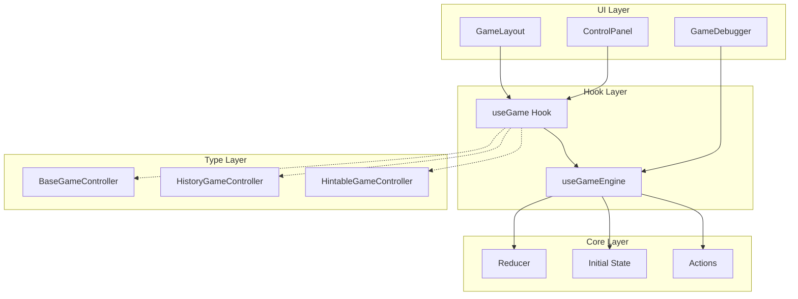

# 設計書 - ゲーム共通タイムトラベル機能

## 概要

本設計書では、要件定義書で定義された全ゲーム共通のタイムトラベル機能を実現するためのアーキテクチャと実装方針を定義する。

### 設計原則

1. **関心の分離**: タイムトラベル機能とゲーム固有ロジックを完全に分離
2. **選択的採用**: ゲームごとに必要な機能のみを選択的に実装可能
3. **型安全性**: TypeScriptの型システムを活用した堅牢な設計
4. **メモリ効率**: アクションベースの履歴管理による効率的なメモリ使用
5. **既存システム統合**: 現在のレスポンシブアーキテクチャとの自然な統合

## アーキテクチャ

### 全体構成



### レイヤー責務

#### UI Layer
- **GameLayout**: レスポンシブレイアウトの管理、コントローラーインターフェースに基づくUI表示
- **ControlPanel**: タイムトラベル操作UI（PC: サイドバー、モバイル: ボトムシート）
- **GameDebugger**: 開発時のアクション履歴とステート監視

#### Hook Layer
- **useGameEngine**: 汎用タイムトラベルエンジン（ゲーム非依存）
- **useGame Hook**: ゲーム固有フック（useReversi等）、useGameEngineをラップ

#### Core Layer
- **Reducer**: 純粋な状態遷移関数
- **Initial State**: ゲームの初期状態
- **Actions**: 状態変更を表現するアクション定義

#### Type Layer
- **インターフェース合成**: 機能の組み合わせを型レベルで表現

## コンポーネント設計

### 1. useGameEngine フック

汎用的なタイムトラベル機能を提供する核となるフック。

```typescript
interface GameEngine<TState, TAction> {
  // 現在の状態
  gameState: TState;
  
  // アクション実行
  dispatch: (action: TAction) => void;
  
  // 基本操作
  reset: () => void;
  reconstruct: (state: TState) => void;
  
  // タイムトラベル操作
  undo: () => void;
  redo: () => void;
  goToIndex: (index: number) => void;
  goToStart: () => void;
  goToEnd: () => void;
  
  // 履歴情報
  history: readonly TAction[];
  currentIndex: number;
  canUndo: boolean;
  canRedo: boolean;
  
  // デバッグ情報
  getDebugInfo: () => DebugInfo<TState, TAction>;
}

function useGameEngine<TState, TAction>(
  reducer: (state: TState, action: TAction) => TState,
  initialState: TState,
  options?: GameEngineOptions
): GameEngine<TState, TAction>
```

#### 実装方針

1. **アクションベース履歴**: `TAction[]`として履歴を保持
2. **状態の動的計算**: `history.slice(0, currentIndex).reduce(reducer, initialState)`
3. **分岐履歴管理**: 履歴途中からの新アクションで分岐を作成
4. **メモ化最適化**: 状態計算結果のメモ化でパフォーマンス向上

### 2. インターフェース拡張設計

既存の`BaseGameController`を拡張し、選択的機能採用を実現。

```typescript
// 基本インターフェース（必須）
interface BaseGameController<TState extends BaseGameState, TAction> {
  gameState: TState;
  dispatch: React.Dispatch<TAction>;
  resetGame: () => void;
  getDisplayStatus: () => string;
  getScoreInfo?: () => ScoreInfo | null;
}

// タイムトラベル機能（選択的）
interface HistoryGameController<TState extends BaseGameState, TAction> 
  extends BaseGameController<TState, TAction> {
  // タイムトラベル操作
  undo: () => void;
  redo: () => void;
  goToIndex: (index: number) => void;
  goToStart: () => void;
  goToEnd: () => void;
  
  // 履歴情報
  canUndo: boolean;
  canRedo: boolean;
  currentHistoryIndex: number;
  historyLength: number;
  
  // 状態再現
  reconstruct: (state: TState) => void;
}

// 型合成パターン
type GameController<TState extends BaseGameState, TAction> = 
  | BaseGameController<TState, TAction>
  | HintableGameController<TState, TAction>
  | HistoryGameController<TState, TAction>
  | (HintableGameController<TState, TAction> & HistoryGameController<TState, TAction>);
```

### 3. GameLayout統合設計

既存のGameLayoutコンポーネントを拡張し、タイムトラベルUIを統合。

```typescript
// ControlPanelの拡張
function ControlPanel<TState extends BaseGameState, TAction>({
  gameController,
  isVisible = true,
  onShowRules,
}: ControlPanelProps<TState, TAction>) {
  // 型ガードによる機能検出
  const hasHistory = 'undo' in gameController && 
                    'redo' in gameController;
  
  // 履歴機能UI（条件付きレンダリング）
  const renderHistoryControls = () => {
    if (!hasHistory) return null;
    
    const historyController = gameController as HistoryGameController<TState, TAction>;
    
    return (
      <div style={styles.historySection}>
        <h4>履歴操作</h4>
        <div style={styles.historyButtons}>
          <Button 
            disabled={!historyController.canUndo}
            onClick={historyController.undo}
          >
            ← 戻る
          </Button>
          <Button 
            disabled={!historyController.canRedo}
            onClick={historyController.redo}
          >
            進む →
          </Button>
        </div>
        <div style={styles.historyInfo}>
          {historyController.currentHistoryIndex + 1} / {historyController.historyLength}
        </div>
      </div>
    );
  };
  
  return (
    <div style={styles.controlPanel}>
      {/* 既存のコントロール */}
      {renderStatusSection()}
      {renderScoreInfo()}
      
      {/* 履歴コントロール（条件付き） */}
      {renderHistoryControls()}
      
      {/* その他のコントロール */}
      {renderActionButtons()}
    </div>
  );
}
```

### 4. GameDebugger統合設計

既存のGameDebuggerを拡張し、アクション履歴の監視機能を追加。

```typescript
interface DebugInfo<TState, TAction> {
  currentState: TState;
  actionHistory: Array<{
    action: TAction;
    timestamp: number;
    resultingState: TState;
  }>;
  currentIndex: number;
  memoryUsage: {
    historySize: number;
    stateSize: number;
    efficiency: number; // vs snapshot approach
  };
}

// GameDebuggerの拡張
function GameDebugger({ isVisible, position }: GameDebuggerProps) {
  // useGameEngineからデバッグ情報を取得
  const debugInfo = useGameEngineDebugInfo();
  
  const renderHistoryView = () => (
    <div style={styles.historyView}>
      <h5>アクション履歴</h5>
      {debugInfo?.actionHistory.map((entry, index) => (
        <div 
          key={index}
          style={{
            ...styles.historyEntry,
            backgroundColor: index === debugInfo.currentIndex ? '#333' : 'transparent'
          }}
        >
          <span>{entry.timestamp}</span>
          <span>{JSON.stringify(entry.action)}</span>
        </div>
      ))}
    </div>
  );
  
  const renderMemoryInfo = () => (
    <div style={styles.memoryInfo}>
      <h5>メモリ効率</h5>
      <div>履歴サイズ: {debugInfo?.memoryUsage.historySize}B</div>
      <div>効率性: {debugInfo?.memoryUsage.efficiency}%</div>
    </div>
  );
  
  return (
    <div style={debuggerStyle}>
      {/* 既存のデバッグ情報 */}
      {renderExistingDebugInfo()}
      
      {/* 新しい履歴デバッグ情報 */}
      {renderHistoryView()}
      {renderMemoryInfo()}
    </div>
  );
}
```

## データモデル

### アクション設計

各ゲームのアクションは、以下の原則に従って設計する：

```typescript
// 基本アクション構造
interface BaseAction {
  type: string;
  timestamp?: number;
  metadata?: Record<string, unknown>;
}

// ゲーム固有アクション例（リバーシ）
type ReversiAction =
  | { type: 'MAKE_MOVE'; row: number; col: number }
  | { type: 'RESET_GAME' }
  | { type: 'SET_HINTS_ENABLED'; enabled: boolean }
  | { type: 'RECONSTRUCT_STATE'; state: ReversiGameState };

// アクションの純粋性保証
function reversiReducer(
  state: ReversiGameState, 
  action: ReversiAction
): ReversiGameState {
  // 純粋関数として実装
  // 副作用なし、同じ入力に対して同じ出力
}
```

### 状態設計

```typescript
// 基本状態構造
interface BaseGameState {
  status: GameStatus;
  currentPlayer: Player | null;
  winner: Player | 'DRAW' | null;
}

// ゲーム固有状態（リバーシ例）
interface ReversiGameState extends BaseGameState {
  board: Board;
  currentPlayer: Player;
  scores: { BLACK: number; WHITE: number };
  gameStatus: 'PLAYING' | 'SKIPPED' | 'GAME_OVER';
  validMoves: Map<string, [number, number][]>;
  
  // ヒント機能（選択的）
  hintsEnabled?: boolean;
  selectedHintCell?: [number, number] | null;
}
```

## エラーハンドリング

### 1. 不正アクション処理

```typescript
function useGameEngine<TState, TAction>(
  reducer: (state: TState, action: TAction) => TState,
  initialState: TState
): GameEngine<TState, TAction> {
  
  const dispatch = useCallback((action: TAction) => {
    try {
      const newState = reducer(currentState, action);
      
      // 状態検証
      if (!isValidState(newState)) {
        console.warn('Invalid state produced by action:', action);
        return; // 状態更新をスキップ
      }
      
      // 履歴更新
      updateHistory(action);
      
    } catch (error) {
      console.error('Action processing failed:', error);
      // エラー時は状態を変更しない
    }
  }, [currentState, reducer]);
  
  return { dispatch, /* ... */ };
}
```

### 2. 状態再現エラー処理

```typescript
const reconstruct = useCallback((newState: TState) => {
  try {
    // 状態検証
    if (!isValidGameState(newState)) {
      throw new Error('Invalid state for reconstruction');
    }
    
    // 履歴リセット
    setHistory([]);
    setCurrentIndex(0);
    setInitialState(newState);
    
  } catch (error) {
    console.error('State reconstruction failed:', error);
    // 現在の状態を維持
  }
}, []);
```

## テスト戦略

### 1. ユニットテスト

```typescript
// useGameEngine のテスト
describe('useGameEngine', () => {
  it('should handle undo/redo correctly', () => {
    const { result } = renderHook(() => 
      useGameEngine(mockReducer, mockInitialState)
    );
    
    // アクション実行
    act(() => {
      result.current.dispatch({ type: 'TEST_ACTION' });
    });
    
    // Undo テスト
    act(() => {
      result.current.undo();
    });
    
    expect(result.current.gameState).toEqual(mockInitialState);
    expect(result.current.canRedo).toBe(true);
  });
  
  it('should maintain memory efficiency', () => {
    // メモリ効率のテスト
    const { result } = renderHook(() => 
      useGameEngine(mockReducer, mockInitialState)
    );
    
    // 大量のアクション実行
    for (let i = 0; i < 1000; i++) {
      act(() => {
        result.current.dispatch({ type: 'TEST_ACTION', value: i });
      });
    }
    
    const debugInfo = result.current.getDebugInfo();
    expect(debugInfo.memoryUsage.efficiency).toBeGreaterThan(80);
  });
});
```

### 2. インテグレーションテスト

```typescript
// GameLayout との統合テスト
describe('GameLayout with History', () => {
  it('should show history controls for history-enabled games', () => {
    const mockHistoryController = {
      ...mockBaseController,
      undo: jest.fn(),
      redo: jest.fn(),
      canUndo: true,
      canRedo: false,
    };
    
    render(
      <GameLayout
        gameName="Test Game"
        gameController={mockHistoryController}
        // ...
      />
    );
    
    expect(screen.getByText('← 戻る')).toBeInTheDocument();
    expect(screen.getByText('進む →')).toBeInTheDocument();
    expect(screen.getByText('進む →')).toBeDisabled();
  });
  
  it('should not show history controls for basic games', () => {
    render(
      <GameLayout
        gameName="Test Game"
        gameController={mockBaseController}
        // ...
      />
    );
    
    expect(screen.queryByText('← 戻る')).not.toBeInTheDocument();
  });
});
```

### 3. E2Eテスト

```typescript
// Playwright E2E テスト
test('time travel functionality works across layouts', async ({ page }) => {
  await page.goto('/games/reversi');
  
  // 数手プレイ
  await page.click('[data-testid="cell-3-2"]');
  await page.click('[data-testid="cell-2-2"]');
  
  // PC レイアウトでの履歴操作
  await page.click('[data-testid="undo-button"]');
  
  // モバイルレイアウトに切り替え
  await page.setViewportSize({ width: 400, height: 800 });
  
  // FAB → ボトムシート → 履歴操作
  await page.click('[data-testid="fab-button"]');
  await page.click('[data-testid="redo-button"]');
  
  // 状態が一貫していることを確認
  const boardState = await page.evaluate(() => 
    window.gameDebugger?.getCurrentState()
  );
  
  expect(boardState).toMatchSnapshot();
});
```

## パフォーマンス考慮事項

### 1. メモ化戦略

```typescript
function useGameEngine<TState, TAction>(
  reducer: (state: TState, action: TAction) => TState,
  initialState: TState
): GameEngine<TState, TAction> {
  
  // 状態計算のメモ化
  const gameState = useMemo(() => {
    return history.slice(0, currentIndex).reduce(reducer, initialState);
  }, [history, currentIndex, initialState, reducer]);
  
  // デバッグ情報のメモ化
  const debugInfo = useMemo(() => ({
    currentState: gameState,
    actionHistory: history.map((action, index) => ({
      action,
      timestamp: Date.now(),
      resultingState: history.slice(0, index + 1).reduce(reducer, initialState)
    })),
    currentIndex,
    memoryUsage: calculateMemoryUsage(history, gameState)
  }), [gameState, history, currentIndex, reducer, initialState]);
  
  return { gameState, debugInfo, /* ... */ };
}
```

### 2. 大量履歴の最適化

```typescript
interface GameEngineOptions {
  maxHistorySize?: number;
  compressionEnabled?: boolean;
  snapshotInterval?: number; // 定期的なスナップショット作成
}

function useGameEngine<TState, TAction>(
  reducer: (state: TState, action: TAction) => TState,
  initialState: TState,
  options: GameEngineOptions = {}
): GameEngine<TState, TAction> {
  
  const { maxHistorySize = 1000, snapshotInterval = 100 } = options;
  
  // 履歴サイズ制限
  const addToHistory = useCallback((action: TAction) => {
    setHistory(prev => {
      const newHistory = [...prev.slice(0, currentIndex), action];
      
      // サイズ制限
      if (newHistory.length > maxHistorySize) {
        return newHistory.slice(-maxHistorySize);
      }
      
      return newHistory;
    });
  }, [currentIndex, maxHistorySize]);
  
  return { /* ... */ };
}
```

## 移行戦略

### 段階的移行計画

1. **Phase 1**: useGameEngine の実装と基本テスト
2. **Phase 2**: 新しいゲーム（TicTacToe等）での採用
3. **Phase 3**: リバーシの既存履歴機能を新システムに移行
4. **Phase 4**: 全ゲームへの展開（選択的採用）
5. **Phase 5**: GameDebugger統合とパフォーマンス最適化

### 既存システムとの共存

```typescript
// 移行期間中の互換性レイヤー
function useLegacyHistoryAdapter<TState, TAction>(
  legacyController: any,
  newEngine: GameEngine<TState, TAction>
): GameController<TState, TAction> {
  
  // 既存インターフェースを新しいインターフェースにマッピング
  return {
    ...legacyController,
    undo: newEngine.undo,
    redo: newEngine.redo,
    canUndo: newEngine.canUndo,
    canRedo: newEngine.canRedo,
    // ...
  };
}
```

この設計により、要件定義で定義された全ての機能を実現し、既存システムとの統合を図りながら、将来の拡張性も確保できる。