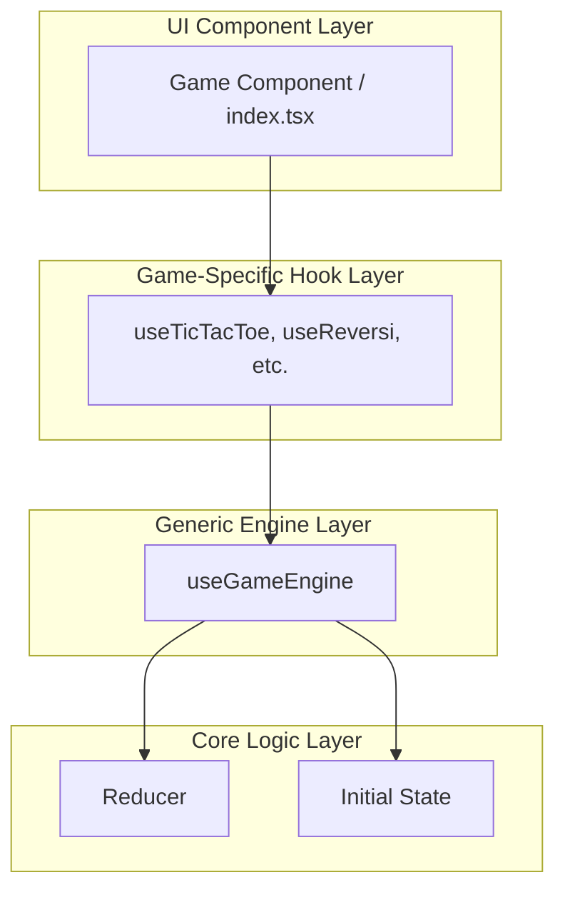

# 状態管理アーキテクチャの分析と設計

## 1. 現状アーキテクチャの分析

`src/core/hooks/useGameEngine.ts`、`src/games/tictactoe/useTicTacToe.ts`、`src/games/tictactoe/index.tsx` を分析した結果、本プロジェクトの状態管理アーキテクチャは以下の特徴を持つ。

### 1.1. アーキテクチャの概要

本プロジェクトは、Reactのカスタムフックを活用した、明確な3層構造の状態管理アーキテクチャを採用している。



1.  **Generic Engine Layer (`useGameEngine`)**:
    *   状態管理の心臓部。
    *   「初期状態」と「アクションの配列」から現在のゲーム状態を導出する、純粋な計算ロジックに特化している。
    *   特定のゲームルールには依存せず、汎用的に利用可能。

2.  **Game-Specific Hook Layer (`useXxx`)**:
    *   汎用的な `useGameEngine` をラップし、各ゲームに特化したインターフェースを提供する層。
    *   UIコンポーネントに対し、`makeMove()` のような直感的な操作関数を公開する。
    *   `gameState` から派生する表示用の情報（例：ステータステキスト）を計算する責務も担う。

3.  **UI Component Layer (`index.tsx`)**:
    *   Game-Specific Hookから状態と操作関数を受け取り、UIの描画に集中する。
    *   勝敗判定後のダイアログ表示のような副作用は `useEffect` を用いて処理する。

### 1.2. 評価できる点 (Pros)

-   **関心の分離の徹底**:
    -   「状態計算」「ゲーム別ロジック」「UI描画」の責務が、それぞれ `useGameEngine`, `useXxx`, `index.tsx` に明確に分離されており、見通しが良くメンテナンス性が高い。
-   **ロジックの純粋性と再利用性**:
    -   ゲームのルールは純粋な `reducer` 関数として定義されるため、単体テストが容易。
    -   `useGameEngine` は汎用的なため、新しいゲームを開発する際に再利用できる。
-   **UIとロジックの疎結合**:
    -   UIコンポーネントは、`dispatch({ type: '...' })` のようなアクションの詳細を意識する必要がない。`makeMove()` のような意味のある関数を通じてロジックとやり取りするため、コードの可読性と保守性が向上している。

### 1.3. 現状の課題と今後の展望

-   **履歴管理の単純化**:
    -   現在の `useGameEngine` は、アクションを履歴の末尾に追加する機能のみを持つ。履歴の途中からの分岐や、過去の状態に戻る（Undo/Redo）といった高度なタイムトラベル機能は実装されていない。
-   **状態再現機能の不在**:
    -   特定の盤面を外部から与えて、その状態からゲームを開始する汎用的な仕組みは存在しない。

## 2. 設計方針

現状の優れたアーキテクチャを基盤としつつ、段階的に機能を拡張していく。

### 2.1. UIフィードバックの考え方

本プロジェクトでは、複雑な時系列アニメーション（例：`setTimeout` を利用したフェードイン）は採用しない。代わりに、**「状態駆動の視覚的フィードバック」** を基本方針とする。

これは、`useGameEngine` によって計算された `gameState` の変化に基づき、UIコンポーネントが即座に `style`（例: `backgroundColor`）を切り替えることで、ユーザーに応答を返すアプローチである。これにより、ロジックの純粋性を保ちながら、UIの応答性を高く維持することができる。

### 2.2. 将来の展望 (Phase 2)

現状の基盤の上に、以下の機能を構築することを次なる目標とする。

#### 2.2.1. タイムトラベル機能の導入
`useGameEngine` を拡張し、完全なタイムトラベル機能を実現する。

-   **一手戻る (Undo)** / **一手進む (Redo)**
-   **履歴内の任意の位置への移動**

これを実現するためには、`useGameEngine` 内部で「現在のアクション履歴上のポインタ」を管理する必要がある。`dispatch` の振る舞いも、ポインタが履歴の途中にある場合は、それ以降の履歴を破棄して新しい分岐を作成するように変更する。

**拡張後の `GameEngine` インターフェース（案）:**
```typescript
export interface GameEngine<TState, TAction> {
  // ...既存のプロパティ...

  // --- タイムトラベル機能 ---
  undo: () => void;
  redo: () => void;
  goToIndex: (index: number) => void;

  // --- 履歴情報 ---
  history: readonly TAction[];
  currentIndex: number;
  canUndo: boolean;
  canRedo: boolean;
}
```

#### 2.2.2. 状態再現機能の実装
任意のゲーム状態をインポートし、盤面を再現する `reconstruct` 機能を追加する。これは、テストの効率化や、特定の問題を再現するデバッグ作業で極めて有用となる。

### 2.3. 期待される効果

この段階的なアプローチにより、以下のメリットが期待される。

-   **堅牢な基盤**: まず確立された3層アーキテクチャにより、コードの品質とメンテナンス性が高く保たれる。
-   **段階的な機能拡張**: プロジェクトの安定性を損なうことなく、タイムトラベルのような高度な機能を安全に追加していくことが可能になる。
-   **テスト容易性の維持**: 機能が追加されても、`reducer` や `useGameEngine` のテスト容易性は維持される。